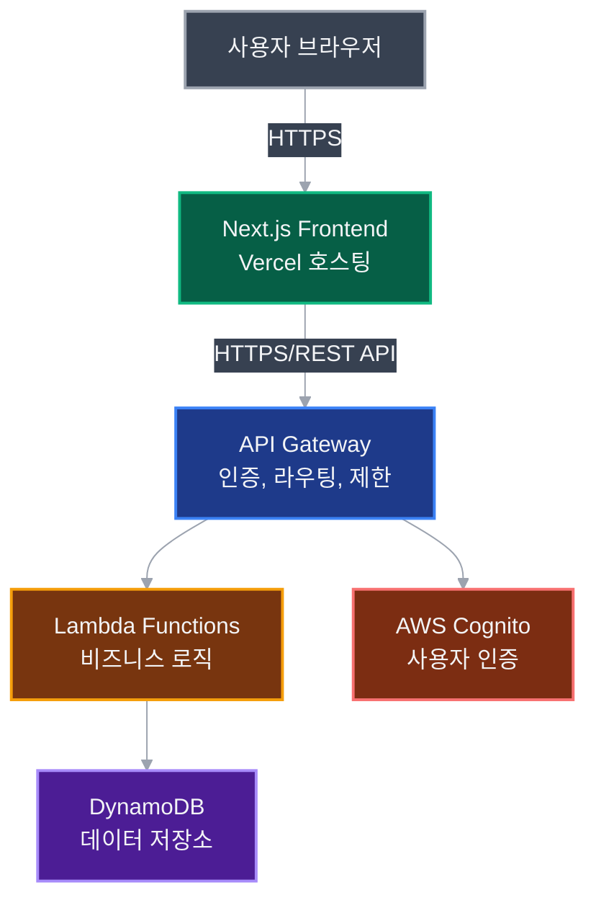
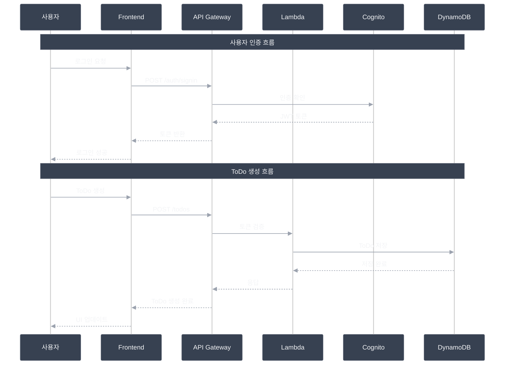
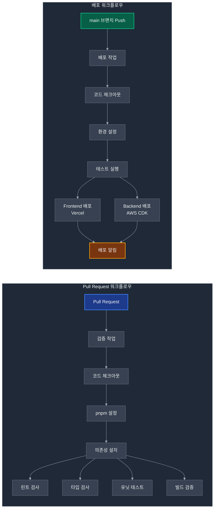
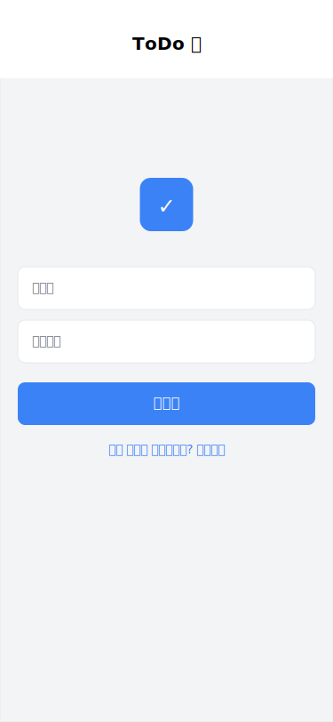
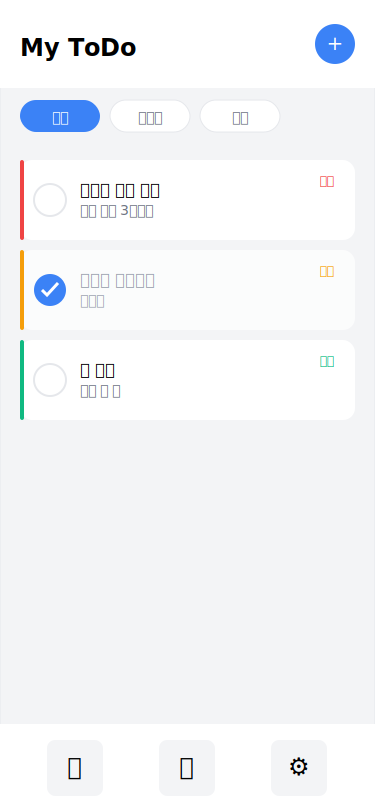
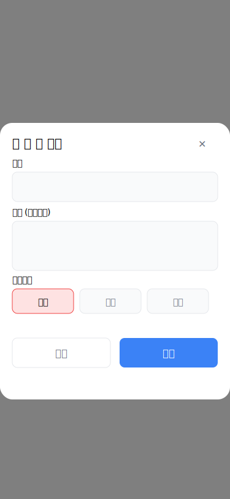
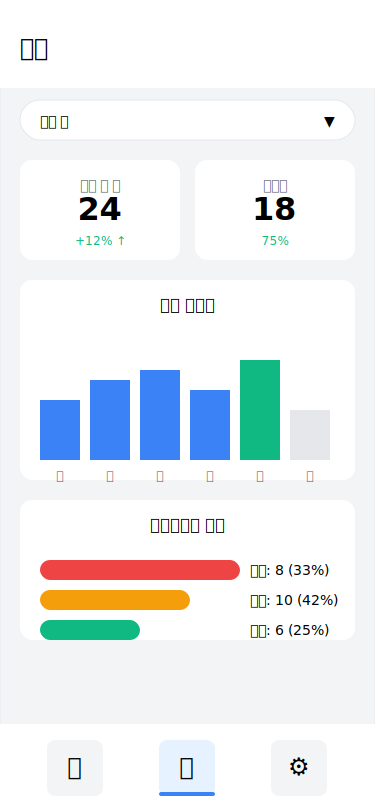

# ToDo 앱 기술 설계 개요

## 개요
이 문서는 ToDo 애플리케이션의 전체적인 아키텍처와 기술 설계 개요를 정의합니다.

---

## 문서 구조

이 프로젝트의 설계 문서는 작업 관련성을 고려하여 다음과 같이 분리되어 있습니다:

- **design-overview.md** (이 문서): 전체 시스템 아키텍처 및 개요
- **api-design.md**: API 설계 및 데이터 모델
- **frontend-design.md**: 프론트엔드 컴포넌트 및 상태 관리
- **backend-design.md**: 백엔드 Lambda 함수 및 서비스 구조
- **deployment.md**: 환경 설정, 배포 및 인프라 구성
- **validation.md**: 에러 처리 및 검증 규칙

---

## 1. 시스템 아키텍처

### 1.1 전체 아키텍처


### 1.2 모노리포 구조
```
ToDoList/
├── packages/
│   ├── frontend/          # Next.js 애플리케이션
│   ├── backend/           # Lambda 함수들
│   ├── shared/            # 공통 타입 및 유틸리티
│   └── infrastructure/    # AWS CDK 인프라 코드
├── docs/                  # 프로젝트 문서
│   ├── design-overview.md # 전체 아키텍처 개요
│   ├── api-design.md      # API 설계
│   ├── frontend-design.md # 프론트엔드 설계
│   ├── backend-design.md  # 백엔드 설계
│   ├── deployment.md      # 배포 및 환경 설정
│   └── validation.md      # 에러 처리 및 검증
├── .github/              # GitHub Actions 워크플로우
├── .husky/               # Git hooks
├── pnpm-workspace.yaml   # pnpm 워크스페이스 설정
└── package.json          # 루트 패키지 설정
```

---

## 2. 기술 스택

### 2.1 프론트엔드
- **프레임워크**: Next.js 14 (App Router)
- **언어**: TypeScript 5.x
- **스타일링**: Tailwind CSS 3.x
- **상태관리**: Zustand
- **폼 관리**: React Hook Form + Zod
- **API 클라이언트**: TanStack Query v5
- **UI 컴포넌트**: shadcn/ui
- **테스트**: Vitest, Testing Library

### 2.2 백엔드
- **런타임**: Node.js 20.x (AWS Lambda)
- **언어**: TypeScript
- **API**: REST API (API Gateway)
- **인증**: AWS Cognito
- **데이터베이스**: DynamoDB
- **IaC**: AWS CDK v2

### 2.3 개발 도구
- **패키지 매니저**: pnpm 8.x
- **린터**: ESLint
- **포매터**: Prettier
- **Git Hooks**: Husky + lint-staged
- **CI/CD**: GitHub Actions

---

## 3. 데이터 흐름도


---

## 4. 보안 설계

### 4.1 인증 및 인가
- JWT 토큰 기반 인증 (Cognito 발급)
- Access Token: 15분 유효
- Refresh Token: 30일 유효
- 모든 API 요청에 Authorization 헤더 필수

### 4.2 보안 정책
- HTTPS 전용 통신
- CORS 화이트리스트 설정
- API Rate Limiting (분당 100회)
- SQL Injection 방지 (DynamoDB 사용)
- XSS 방지 (React 자동 이스케이핑)
- CSRF 방지 (SameSite 쿠키)

---

## 5. CI/CD 파이프라인



---

## 6. 성능 최적화

### 6.1 프론트엔드 최적화
- Next.js 이미지 최적화
- 코드 스플리팅
- 동적 임포트
- React Query 캐싱
- Tailwind CSS 퍼지

### 6.2 백엔드 최적화
- Lambda 콜드 스타트 최소화
- DynamoDB 읽기/쓰기 용량 최적화
- API Gateway 캐싱
- 배치 작업 처리

---

## 7. 모니터링 및 로깅

### 7.1 모니터링
- CloudWatch 대시보드
- Lambda 함수 메트릭
- API Gateway 메트릭
- DynamoDB 메트릭

### 7.2 로깅
- 구조화된 JSON 로깅
- 로그 레벨 관리
- CloudWatch Logs Insights

---

## 8. UI 디자인 와이어프레임

모바일 중심의 UI 디자인으로 iPhone 화면 크기(375x812)를 기준으로 설계했습니다.

### 8.1 로그인 페이지


사용자 인증을 위한 간단하고 직관적인 로그인 화면입니다.

### 8.2 ToDo 목록 페이지


할 일 목록을 확인하고 관리할 수 있는 메인 화면입니다. 우선순위별 색상 구분과 상태별 필터링 기능을 제공합니다.

### 8.3 ToDo 추가/편집 모달


새로운 할 일을 추가하거나 기존 할 일을 편집할 수 있는 모달 화면입니다.

### 8.4 통계 페이지


할 일 완료율과 진행 상황을 시각적으로 확인할 수 있는 통계 화면입니다.

---

## 9. 개발 가이드라인

### 9.1 코드 스타일
- ESLint + Prettier 설정 준수
- TypeScript strict mode
- 함수형 프로그래밍 선호
- 명확한 변수/함수명

### 9.2 커밋 컨벤션
```
feat: 새로운 기능 추가
fix: 버그 수정
docs: 문서 수정
style: 코드 포매팅
refactor: 코드 리팩토링
test: 테스트 추가/수정
chore: 빌드 프로세스 등 기타 변경
```

### 9.3 브랜치 전략
- main: 프로덕션 배포
- develop: 개발 통합
- feature/*: 기능 개발
- hotfix/*: 긴급 수정